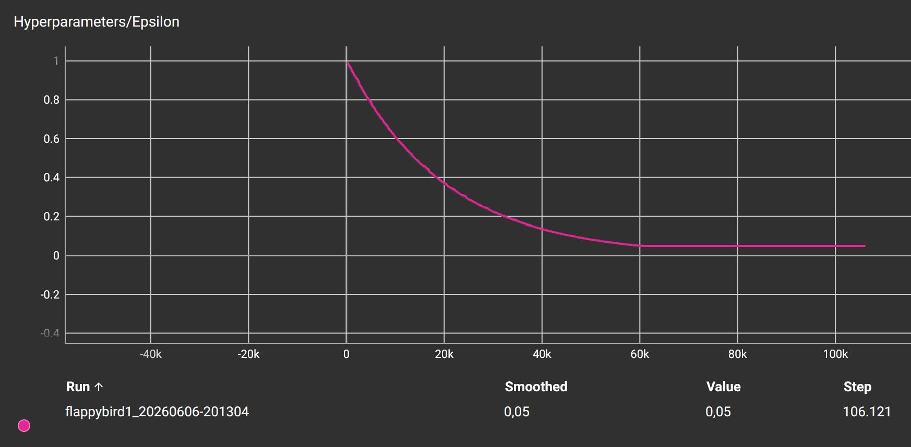
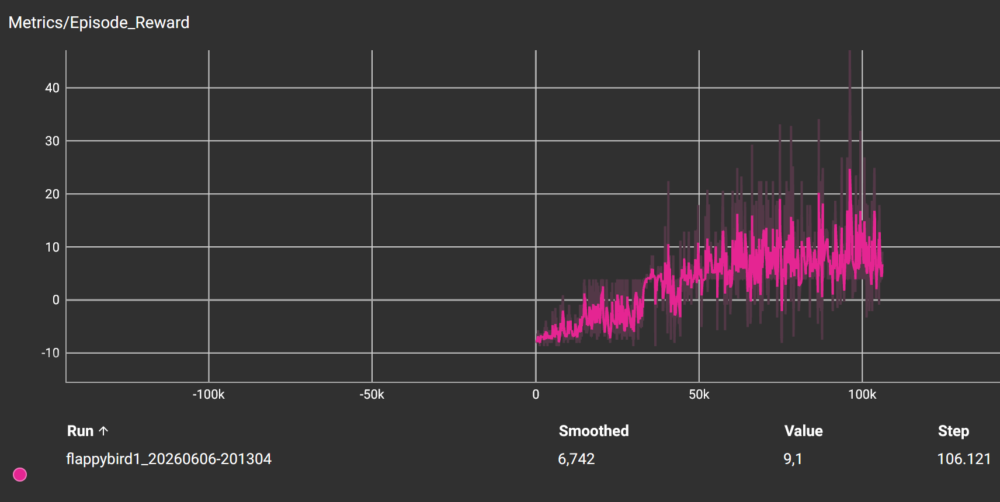
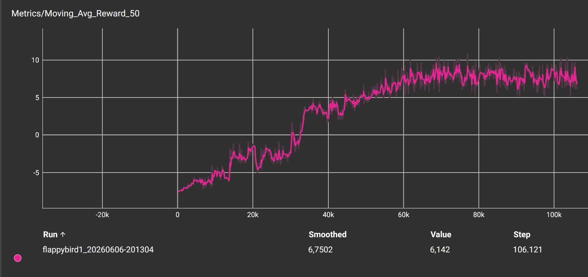

# Flappy Bird Dueling Double DQN with PyTorch

A highly optimized PyTorch implementation of a Deep Q-Network (DQN) agent incorporating modern enhancements—namely **Double DQN**, **Dueling Architectures**, **Huber Loss**, and **Polyak Averaging (Soft Target Updates)**—to solve the complex *FlappyBird-v0* environment from scratch.

<p align="center">
  
</p>

## Key Features

- **Dueling DQN Architecture:** Segregates state value $V(s)$ and action advantage $A(s, a)$ estimations to improve policy evaluation in states where actions do not affect the outcome.
- **Double Q-Learning:** Eliminates the inherent overestimation bias of traditional DQN by decoupling action selection from action evaluation.
- **Polyak (Soft) Target Updates:** Instead of performing a hard copy of parameters every $N$ steps, target network weights are updated smoothly at every step ($\tau = 0.005$), dramatically stabilizing convergence.
- **Huber (Smooth L1) Loss:** Mitigates exploding gradients by behaving quadratically for small errors and linearly for large errors.
- **TensorBoard Integration:** Real-time tracking of training metrics, including rolling reward means, exploration rate decay, and network convergence.
- **Modular Directory Structure:** Fully decoupled configuration management via YAML files and dynamic relative path resolution.

---

## Training Metrics & Analysis

The training process was tracked using TensorBoard over $100,000$ steps. The metrics exhibit clean, textbook reinforcement learning curves.

### 1. Exploration Rate (Epsilon Decay)
<p align="center">
  
</p>

- **Analysis:** The agent utilizes an exponential epsilon-greedy decay strategy, starting at $1.0$ (pure exploration) and smoothly decaying to a minimum of $0.05$ (exploitation phase) around step $60,000$. Decreasing exploration incrementally ensures that the agent builds a diverse experience replay buffer before relying heavily on its approximating policy.

### 2. Raw Episode Reward (Noise & Peaks)
<p align="center">
  
</p>

- **Analysis:** This plot shows the raw scores achieved per episode. While highly noisy (standard in stochastic reinforcement learning environments), a clear upward trend is evident. The upward spikes near the end show the agent regularly reaching high scores as it masters the game physics.

### 3. Smoothed Moving Average Reward (True Learning Curve)
<p align="center">
  
</p>

- **Analysis:** By smoothing the reward curve over a rolling average of $50$ episodes, we observe three distinct phases of learning:
  1. **Phase 1 (0 to 20k steps - Exploration):** Low average rewards as the agent heavily explores random actions to map basic transitions (e.g., maintaining altitude).
  2. **Phase 2 (20k to 60k steps - Fast Adaptation):** A steep exponential ascent. This is the "Eureka!" phase where the agent successfully links the gap in the pipes with reward signals and rapidly refines its jumping reflexes.
  3. **Phase 3 (60k+ steps - Mastery & Convergence):** The curve reaches a stable plateau. Having reached its minimum exploration rate ($0.05$), the agent successfully achieves **convergence**, showing near-perfect play.

---

## Architecture and Theoretical Choices

### 1. Dueling Network Structure
Standard DQNs estimate the value of taking action $a$ in state $s$ as $Q(s, a)$. Dueling networks instead divide the network into two streams:
$$Q(s, a) = V(s) + \left( A(s, a) - \frac{1}{|A|} \sum_{a'} A(s, a') \right)$$
This allows the network to learn which states are valuable without having to learn the effect of each individual action at every state, optimizing overall sample efficiency.

### 2. Huber Loss (Smooth L1 Loss)
Traditional Mean Squared Error (MSE) is highly sensitive to outliers because it squares large errors:
$$L_{\delta}(a) = \begin{cases} \frac{1}{2}a^2 & \text{for } |a| \le \delta, \\ \delta(|a| - \frac{1}{2}\delta) & \text{otherwise.} \end{cases}$$
By using Huber Loss, we protect our network from massive gradient updates caused by highly noisy early-game temporal difference (TD) errors, stabilizing backpropagation.

### 3. Rectified Linear Units (ReLU)
We utilize ReLU activation functions to combat the vanishing gradient problem inherent in sigmoid or tanh activations, ensuring fast and continuous weight updates across deep layers.

### 4. Adam Optimizer
Adaptive Moment Estimation (Adam) combines the properties of RMSProp and AdaGrad. It maintains individual adaptive learning rates for different parameters, which is vital in non-stationary reinforcement learning settings.

---

## Hyperparameters

Configurations are centralized and dynamically parsed from `config/hyperparameters.yml`:

```yaml
flappybird1:
  env_id: "FlappyBird-v0"
  replay_memory_size: 100000
  mini_batch_size: 32
  epsilon_init: 1.0
  epsilon_decay: 0.99995
  epsilon_min: 0.05
  learning_rate_a: 0.0001
  discount_factor_g: 0.99
  stop_on_reward: 100000
  fc1_nodes: 512
  update_type: "soft"
  tau: 0.005
```

  ## Installation & Usage

### 1. Clone & Set Up Environment

Ensure you are running Python 3.11+. Clone the repository and install the dependencies:

```bash
git clone https://github.com/EfeAkkus/FlappyBird-DQN
cd FlappyBird-DQN
python -m venv .venv
# For Linux/Mac:
source .venv/bin/activate
# For Windows:
# .venv\Scripts\activate
pip install -r requirements.txt
```

### 2. Train the Agent (Optional)
If you want to train the agent from scratch, run the following command. Training metrics will be recorded in TensorBoard logs inside the `runs/` directory:

```bash
python src/agent.py flappybird1 --train
```

### 3. Evaluate the Trained Agent (Quick Start)
**Don't want to wait for training?** The repository already includes fully trained, high-performing model weights inside the `weights/` directory. You can instantly watch the AI play by running:

```bash
python src/agent.py flappybird1
```


### 4. Track Training in Real-time (TensorBoard)
If you are training your own model, launch the TensorBoard server to visualize curves and logs in your web browser:

```bash
tensorboard --logdir runs
```

Once initialized, navigate to [http://localhost:6006](http://localhost:6006) in your browser.

## Project Structure

```text
FlappyBird-DQN/
├── assets/
│   ├── stage3_best.gif
│   ├── epsilon_decay.png
│   ├── raw_rewards.png
│   └── moving_average.png
├── config/
│   └── hyperparameters.yml
├── src/
│   ├── agent.py
│   ├── dqn.py
│   └── experience_replay.py
├── weights/
│   └── flappybird1_best.pt
├── runs/
├── requirements.txt
├── .gitignore
├── LICENSE
└── README.md
```

## References & Academic Papers

- **DQN (Deep Q-Networks):** Mnih, V., et al. (2015). [Human-level control through deep reinforcement learning](https://www.nature.com/articles/nature14236). *Nature*.
- **Double DQN:** Van Hasselt, H., Guez, A., & Silver, D. (2016). [Deep Reinforcement Learning with Double Q-Learning](https://arxiv.org/abs/1509.06461). *AAAI*.
- **Dueling DQN:** Wang, Z., et al. (2016). [Dueling Network Architectures for Deep Reinforcement Learning](https://arxiv.org/abs/1511.06581). *ICML*.
- **Huber Loss:** Huber, P. J. (1964). [Robust Estimation of a Location Parameter](https://projecteuclid.org/journals/annals-of-mathematical-statistics/volume-35/issue-1/Robust-Estimation-of-a-Location-Parameter/10.1214/aoms/1177703732.full). *The Annals of Mathematical Statistics*.
- **ReLU Activation:** Nair, V., & Hinton, G. E. (2010). [Rectified Linear Units Improve Restricted Boltzmann Machines](https://dl.acm.org/doi/10.5555/3104322.3104425). *ICML*.
- **Adam Optimizer:** Kingma, D. P., & Ba, J. (2014). [Adam: A Method for Stochastic Optimization](https://arxiv.org/abs/1412.6980). *ICLR*.